# 国内用户如何高效开通Claude Pro

github地址：https://github.com/JumorHack/claude-recharge-tutorial

我用官方直充的 Claude 账号已经三四个月了，期间也常帮朋友搭建访问 Claude 的网络环境、处理充值问题，索性把整个流程整理成这篇教程。

实测也适用于Chatgpt，只不过Chatgpt封号机制没Claude这么严格，不需要这么严格的网络环境。

目前国内用户接触 Claude，主流方式几乎都是**代充**或**中转站**，但这两种方案的质量都参差不齐：

- **代充**：一旦封号，通常只有开通后的头几天还可能有售后退款；过了这个窗口，有的商家干脆就不退了。
- **中转站**：对我这种重度用户来说单价偏高，随便用上一天，烧掉的钱就可能超过官方会员的月费；而且你无从确认它背后到底是不是 Claude，还是套了壳的其它模型。

权衡之下，我自己走的是官方直充路线：**美区静态 IP + 美区苹果 ID + Apple Pay**。它前期配置稍显麻烦，但胜在稳定、价格透明、模型货真价实；而且**即便账号被封，钱也能退回到你自己的账户里**。

下面就从三个方面，把这条路线完整讲清楚：

- [网络环境配置](#网络环境配置)
  - [代理环境搭建](#代理环境搭建)
  - [静态住宅 IP](#静态住宅-ip)
  - [手机端静态 IP](#手机端静态-ip)
- [支付方式](#支付方式)
- [充值 Claude 会员](#充值-claude-会员)

## 网络环境配置

网络环境是最重要的一环。Claude 的封禁机制极其严格（最近似乎稍有放宽），一旦检测到 IP 异常，就会直接封号。

问题在于，我们日常用的普通梯子根本满足不了要求：共享人数太多，而且基本一连上就会被识别为机房 IP。正确的做法是，在梯子的基础上再叠加一层**静态住宅 IP**，让出口 IP 看起来像是真实住户在正常上网。

这一环节的关键是链式代理，需要准备：
- Clash(PC)
- Shadowrocket(ios)
- 一个能接入 Clash 的机场
- 静态住宅 IP

接下来我会逐一讲解如何配置以及购买渠道。

### 代理环境搭建

我用的梯子是 [扬云帆](https://ml.yfqz1.net/register?code=M4g4W56g)，目前用着还算流畅；当然，其它能用 Clash 接入的机场也都可以。Clash 客户端我用的是 [Clash Verge](https://github.com/clash-verge-rev/clash-verge-rev)：在 [release 页面](https://github.com/clash-verge-rev/clash-verge-rev/releases) 下载对应系统的安装包，安装后一键导入订阅链接即可。

注册链接：https://ml.yfqz1.net/register?code=M4g4W56g

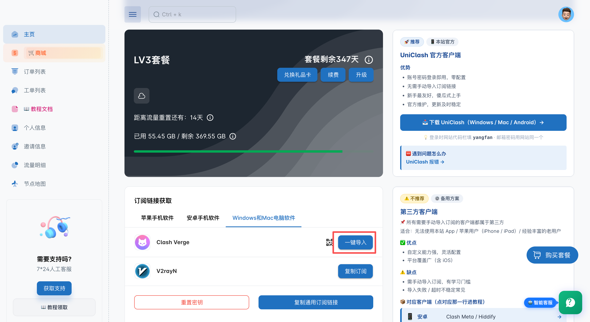

导入后，就能在 Clash 的订阅列表里看到我们的节点了。

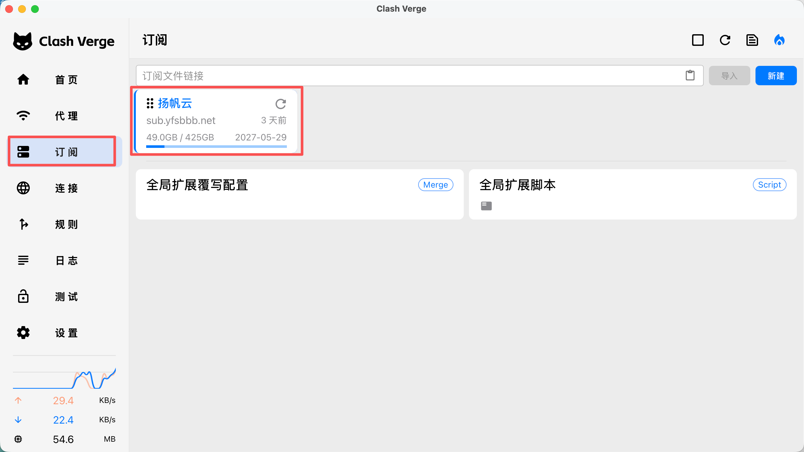

### 静态住宅 IP

接下来需要购买一个静态住宅 IP，我用的是 [cliproxy](https://share.cliproxy.com/share/cj29z1pvd)。进入个人看板后，依次选择「长效静态 ISP」→「账密模式」→「立即购买」，下单一个 IP。**注意：一定要购买 Claude 支持地区的 IP，否则后续登录不了**，支持地区详见 [Claude 官方文档](https://platform.claude.com/docs/zh-CN/api/supported-regions)。这里建议直接买美国 IP，因为后面的支付环节同样要用到美国 IP。

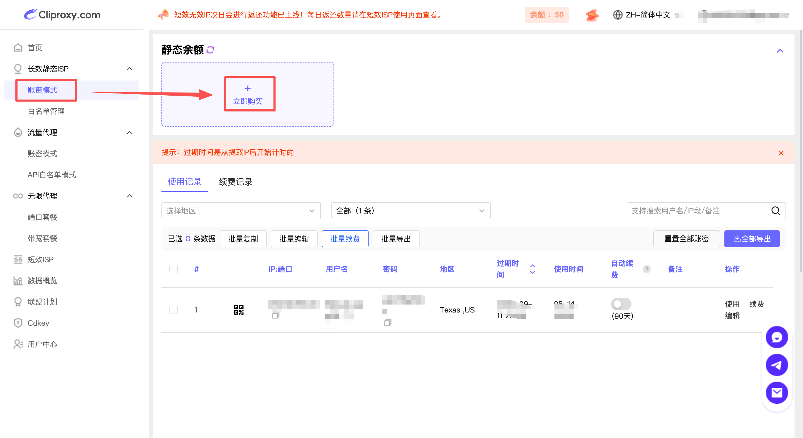

注册链接：https://share.cliproxy.com/share/cj29z1pvd

拿到静态住宅 IP 后，在购买的 IP 上点击「使用」→ 格式选择 **socks5** → 复制。

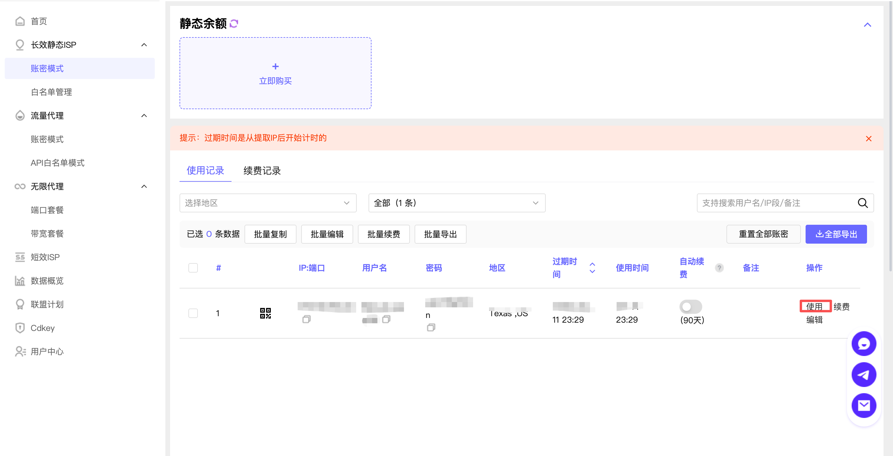
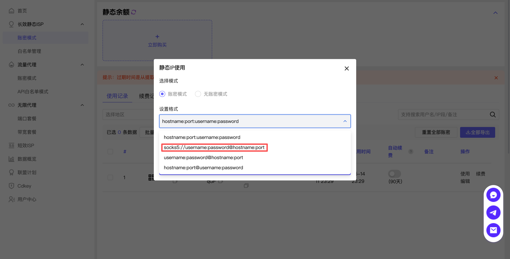

打开 Clash，右键订阅，选择「编辑节点」，粘贴前面复制的 socks5 内容，在 `#` 后面加上自己的备注，然后点击「添加前置代理节点」。

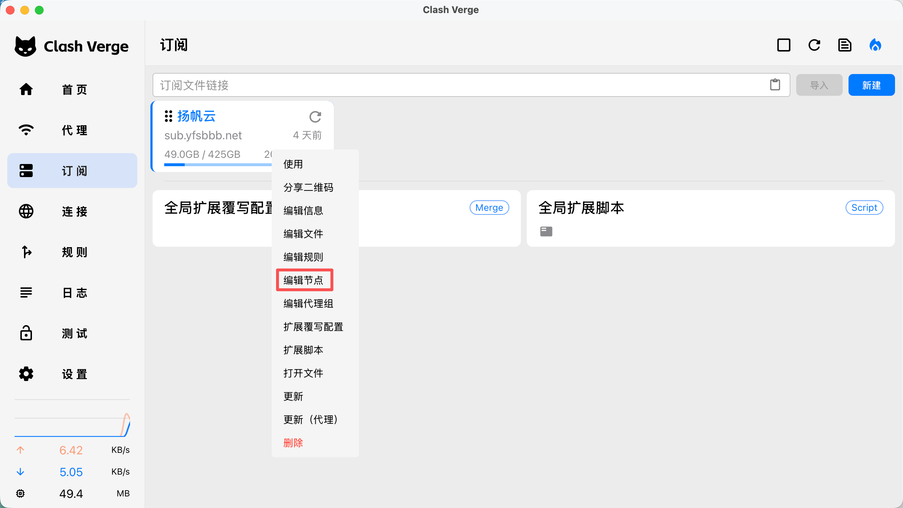
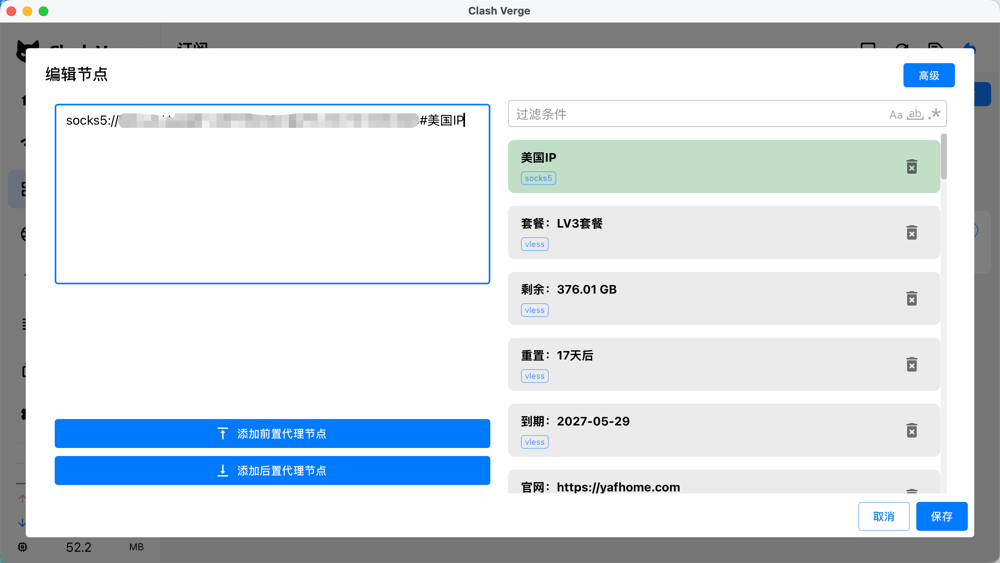

回到「首页」，把「系统代理」和「虚拟网卡模式」都打开。

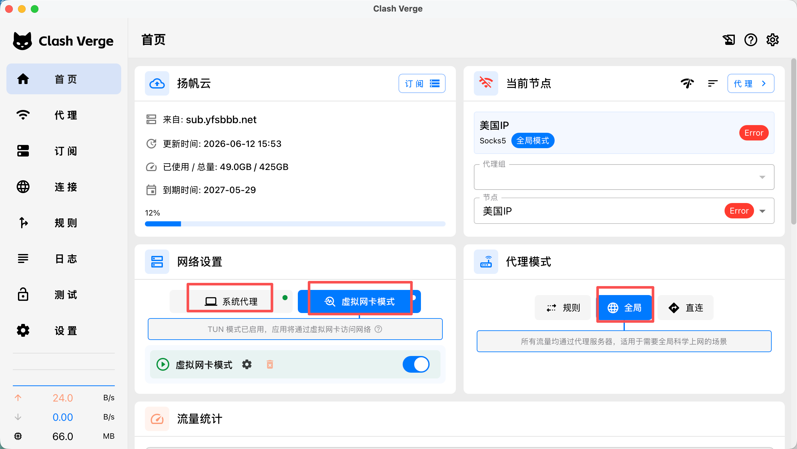

进入「代理」，依次点击「链式代理」→ 选择任意一个节点 → 再选择刚才设置的静态 IP 节点 → 点击「连接」。

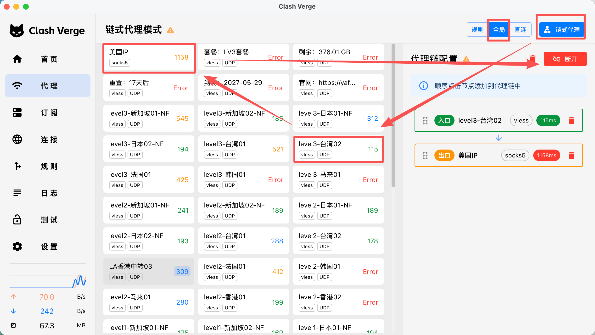

这时用 [ping0.cc](https://ping0.cc/) 检测一下 IP，就会发现当前 IP 已经变成我们的静态 IP 了。

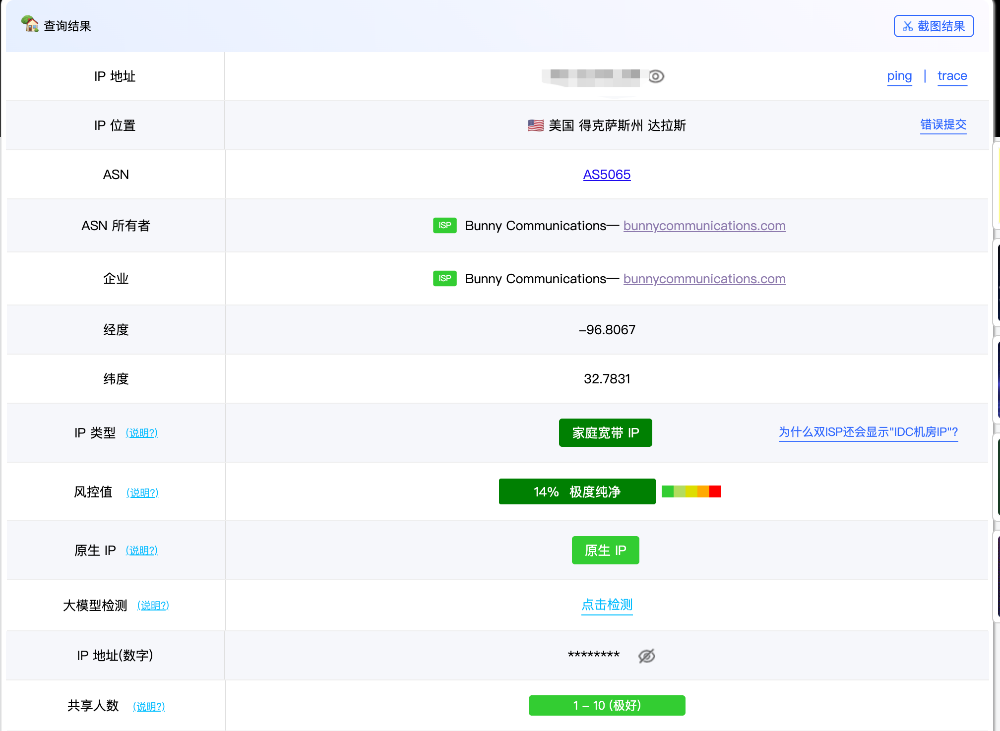

### 手机端静态 IP

这部分只针对 iOS 用户。

首先要准备一个**美区 Apple ID**，并下载 **Shadowrocket**（小火箭）。网上教程很多：图省事可以直接买一个已经带 Shadowrocket 的美区 ID；想省钱的话，也可以先注册一个纯净的美区 ID，再按[支付方式](#支付方式)一节绑定信用卡后自行购买下载，这样更便宜。

下面默认你已经有了**美区 ID** 和 **Shadowrocket**。

打开 Shadowrocket，进入「配置」，点击右上角的「+」，把机场网站上的订阅链接复制进来并导入。

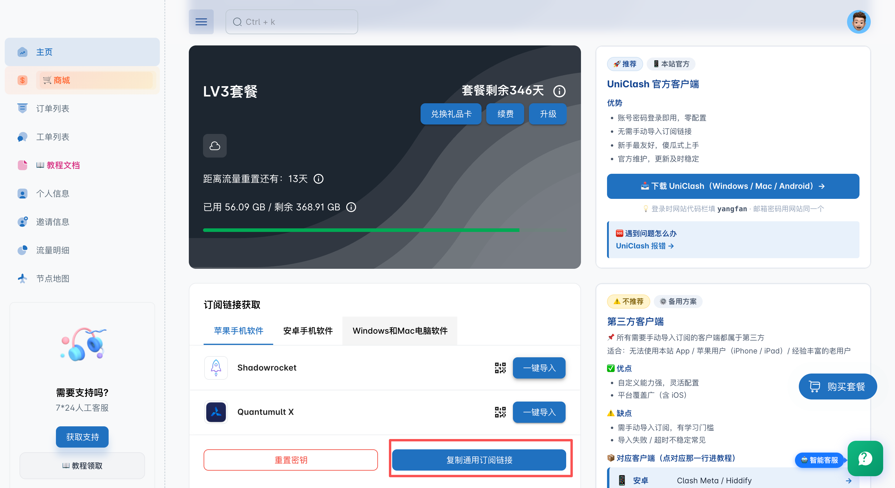
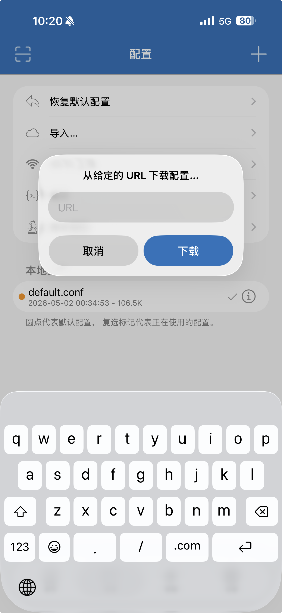

回到首页，就可以连接我们的梯子了。

点击首页右上角的「+」添加节点，在「类型」里选择 socks5，再把「地址」「端口」「用户」「密码」都填上之前静态 IP 页面里的信息。

接着点击「代理通过」，选择订阅里的任意一个节点，返回后点击右上角保存即可。

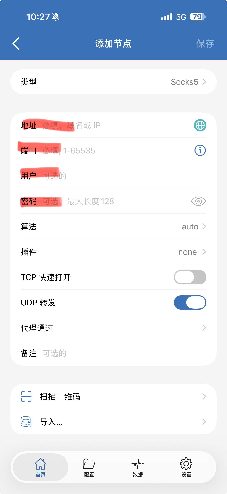

回到首页，本地节点里就会出现刚才添加的节点。点进这个节点，把「全局路由」改为「代理」，不要开启「回退」。

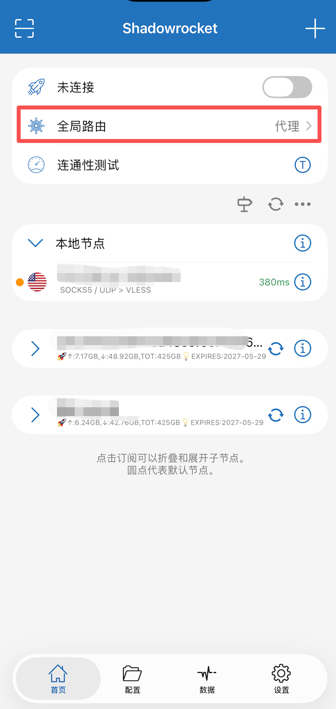
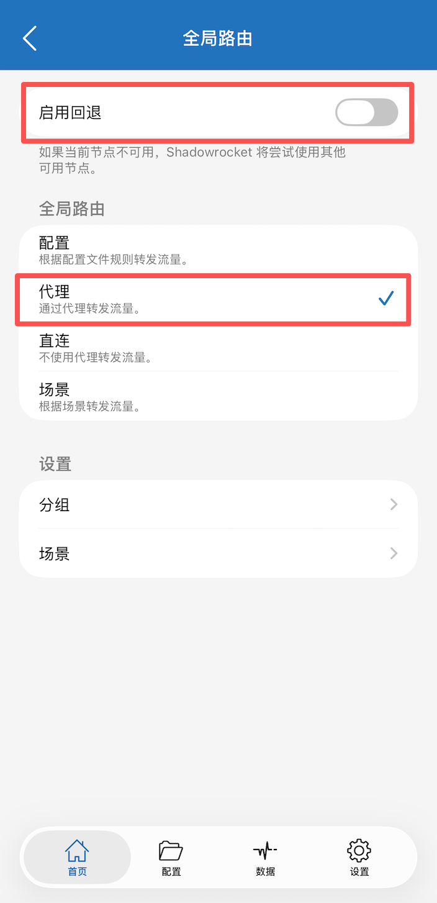

最后点击连接即可。

## 支付方式

充值 Claude 会员的付款方式主要有两种，任选其一即可：

- **方式一 · 绑定 U 卡**：用虚拟信用卡（U 卡）配合网页版 Apple Pay 付款，适合想直接在网页升级的人。
- **方式二 · 苹果礼品卡**：把美区礼品卡兑换成 Apple ID 余额，再通过 App Store 内购扣款，全程无需信用卡，也省去身份认证。

7.4日更：目前大陆身份证办理不了u卡了，得看后续能不能重新放开了，目前只能走礼品卡充值，一般淘宝买就行，会比实际汇率贵个七八块。

> 美区ID注册有很多现有教程，也可以去网上买，但我看现在价格好像都十几二十块，但其实注册也只是动动手指的事情，我记得我以前买才四五块，如果有需要可以加我vx：jumorhack，我可以帮忙在你自己的号上改地区。
>
> 注册过程中如果遇到需要海外手机号验证的情况，可以试一下接码平台 [DogeSMS](https://www.dogesms.com/r/LWa6ay)。

### 方式一：绑定 U 卡

U 卡我选的是 [Roogoo](https://wap.roogoo.store/register?inviteCode=sz1xg0)，注册后按指引完成卡片申请即可，过程中需要做身份认证（之前能用身份证，最近政策收紧已经用不了了，但应该可以用护照申请）。

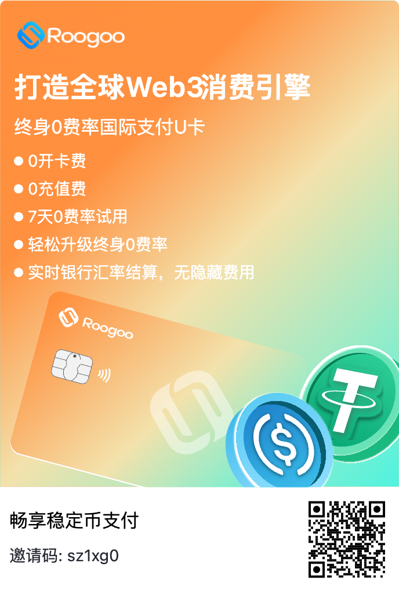

注册链接：https://wap.roogoo.store/register?inviteCode=sz1xg0

通过本链接注册可享免费开卡、7 天 0 费率试用，还能升级为终身 0 费率；另有余额赚币、消费挖矿、邀请返佣等奖励。

卡片申请下来后，点击「卡片」→「卡号」，就能查看信用卡信息，后面填写支付方式时要用。

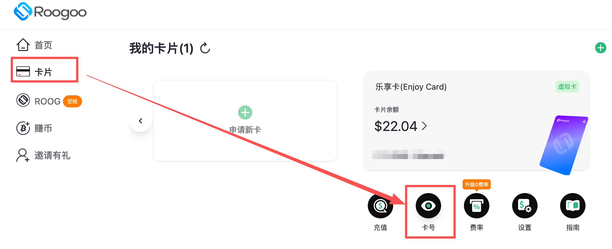

在手机上登录美区 ID（只需在 App Store 登录即可）：打开 App Store，点击右上角个人头像 → 进入账户 →「管理付款方式」→「添加付款方式」→ 选择借记卡，把卡片信息填进去即可（姓名、地址都要和卡片一致）。

### 方式二：苹果礼品卡充值

如果不想办 U 卡，也可以直接用**美区苹果礼品卡**（Apple Gift Card / App Store 充值卡）充值。**一定是要美区ID**。

1. **购买礼品卡**：买一张**美区**面额（美元）的礼品卡，区域必须和你的美区 ID 一致，否则无法兑换。可以在正规渠道或第三方卡商购买兑换码，按需选择金额即可。（一般就淘宝买一下，最好不要找太过便宜的卡）
2. **兑换到余额**：打开 App Store → 点击右上角头像 →「兑换充值卡或代码」→ 手动输入兑换码（或用相机扫码）。兑换成功后，金额会充进你美区 Apple ID 的账户余额。
3. **用余额扣款**：苹果礼品卡余额**只能走 App Store 内购，不能用于网页版 Apple Pay**。所以要在 **Claude 的 iOS App 内**点击升级订阅，系统会优先扣除 Apple ID 余额，即用礼品卡完成充值。账号地区记得选择免税州。

> 提示：通过 App Store 内购的订阅价格有时会比网页版略高（苹果会抽成），充值前可以对比一下再决定用哪种方式。

如果遇到支付失败，可以参考[这篇知乎文章](https://zhuanlan.zhihu.com/p/1987246308558403449)，帮别人充值 ChatGPT 遇到这个问题按照这个方法就解决了，就是得等几天。

## 充值 Claude 会员

接下来就很简单了，先确保连上静态 IP 节点，再根据你选的付款方式操作：

- **U 卡**：打开网页版 Claude，登录账号，点击「升级方案」，用 Apple Pay（绑定的 U 卡）付款即可。
- **苹果礼品卡**：打开 Claude 的 iOS App，登录账号，在 App 内点击升级订阅，系统会自动扣除 Apple ID 余额。
